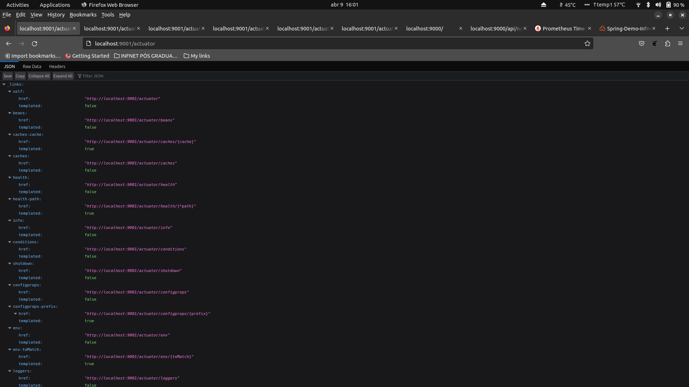
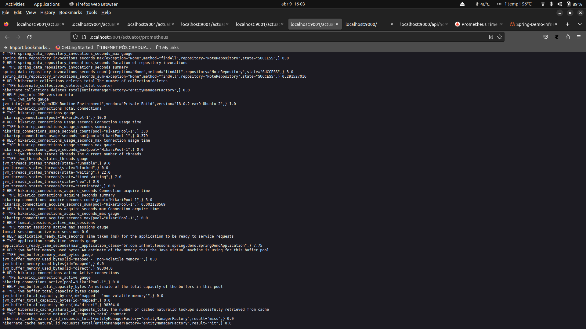
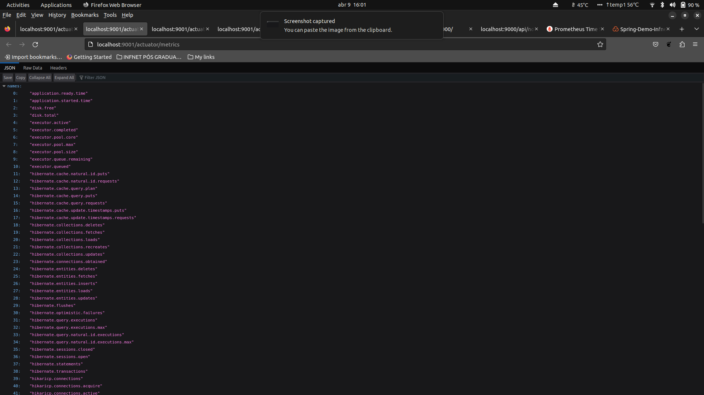

## Actuator Metrics
 

**ACTUATOR API**
 

**ACTUATOR CACHES**
 

**ACTUATOR PROMETHEUS**
 

**ACTUATOR METRICS**
 

**ACTUATOR HEALTH**
 

🔙 [Voltar ao repositório](https://github.com/npalleta/Spring-Demo-Infnet)

---