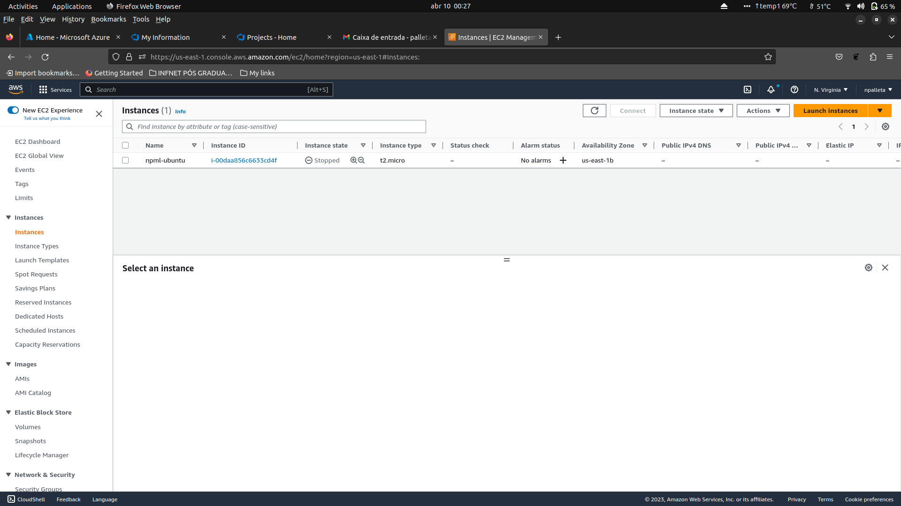
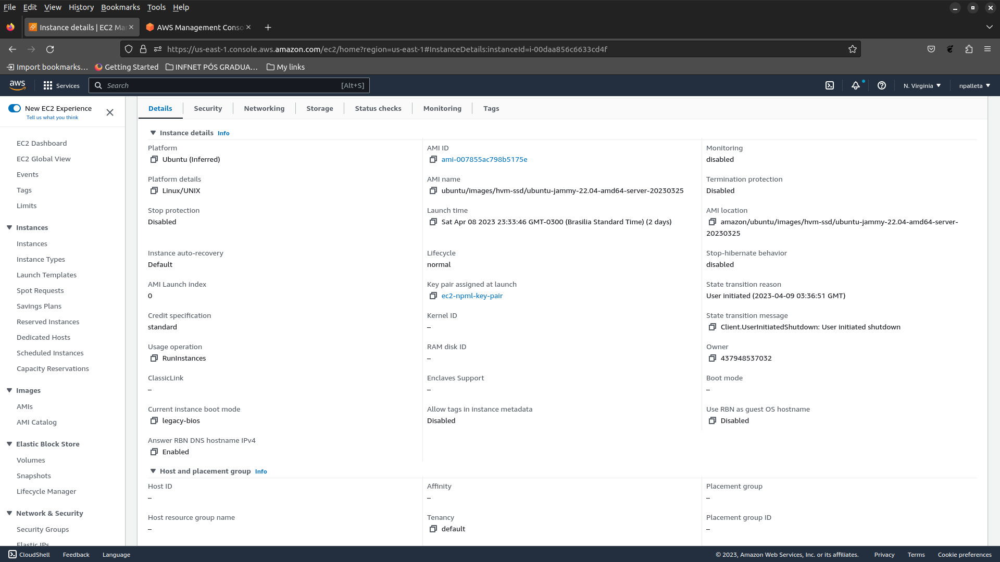

## Sonarcloud

**TERRAFORM + AWS EC2**
<br />

### Como configurar os arquivos para criação do EC2

1. Para a criação da sua instância de **EC2**, você irá precisar configurar o seguinte item:

 - Uma **VPC** e obter uma **subnet**;

2. **No terraform.tfvars**, que está na pasta **terraform_ec2instance**, inclua os seguintes valores:

```bash
access_key = "" <-- Incluir sua access_key gerada na plataforma AWS
secret_key = "" <-- Incluir sua secret_key gerada na plataforma AWS
```

3. Após isso, dentro da mesma pasta, execute:

```bash
terraform init
terraform plan
terraform apply
```

4. Para excluir a instância, use:

```bash
terraform destroy
```

---

**TERRAFORM - EC2**
<br />



**TERRAFORM - EC2 DETAILS**
<br />



🔙 [Voltar ao repositório](https://github.com/npalleta/Spring-Demo-Infnet)

---